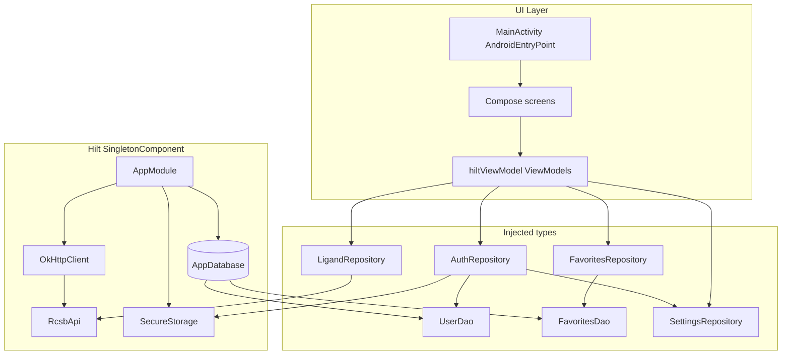

# Hilt in Swifty Protein

This document explains what **Hilt** is, why the app uses it, **what Dagger does underneath**, and **how instances are created at compile time**. It also describes **exactly how dependency injection is wired** in this project.

## Dependency injection in one sentence

**Dependency injection** means: objects do not construct their own collaborators (`new OkHttpClient()` inside a repository). Instead, their dependencies are **supplied from outside** (constructor parameters). A **DI framework** knows how to build that chain so each type gets what it needs.

## What Dagger is

**[Dagger](https://dagger.dev/)** is a **compile-time** DI framework for Java and Kotlin.

| Idea | Meaning |
|------|---------|
| **Object graph** | A directed graph of types: edges mean “A needs a B to be constructed.” |
| **Binding** | A rule that says “when someone asks for type `T`, create it **this** way.” |
| **Component** | A Dagger **interface** annotated with `@Component`. At build time Dagger generates its **implementation**: a class that can create every type reachable from that component’s roots. |
| **Module** | A class/object with `@Module` holding **`@Provides`** or **`@Binds`** methods—factory-style bindings Dagger cannot infer from constructors alone. |

**Why compile-time?** Dagger analyzes your graph **when you compile**. If `RcsbApi` needs `OkHttpClient` but nothing provides `OkHttpClient`, the build **fails immediately** with a clear error. That is different from runtime reflection-based containers where missing bindings surface only when the user hits a code path.

**Core annotations:**

- **`@Inject`** on a constructor tells Dagger “you may **`new` this class** by resolving its constructor parameters from the graph.”
- **`@Provides`** in a module tells Dagger “call **this method** to obtain an instance of the return type.”
- **`@Singleton`** (and other scopes) tie an instance’s lifetime to **one instance per component** for that binding.

Vanilla Dagger on Android used to require **you** to write `@Component` interfaces, decide subcomponents for activities, and wire everything manually. **Hilt removes almost all of that.**

## What Hilt is

**Hilt** is Google’s recommended layer **on top of Dagger** for Android. It:

1. Predefines a **standard set of Dagger components** mapped to Android lifecycles (`SingletonComponent`, activity/fragment scopes, etc.).
2. **Aggregates** all `@Module @InstallIn(...)` classes into those components automatically.
3. Generates **entry-point glue** (`@HiltAndroidApp`, `@AndroidEntryPoint`) so Activities, Services, and other Android types hook into the graph without custom `@Component.Builder` code.
4. Integrates **Jetpack** artifacts (`@HiltViewModel`, WorkManager, etc.) via extra processors and artifacts.

So: **Hilt does not replace Dagger**—it **generates Dagger components and factories** for you. This project runs **Hilt’s annotation processor via KSP** (`ksp(libs.hilt.compiler)`), which emits Java/Kotlin sources under `build/generated/` that implement the graph.

## Hilt’s Android component hierarchy (mental model)

Hilt installs bindings into **components** that nest logically with Android lifetimes (only a subset may matter for a given app):

```text
SingletonComponent          ← process / Application-wide (this app uses AppModule here)
  └── ActivityRetainedComponent
        └── ActivityComponent
              └── FragmentComponent
                    └── ViewComponent
```

**This project** puts almost everything in **`SingletonComponent`** via `AppModule`. That matches long-lived dependencies (database, HTTP client, repositories). `ViewModel`s are **not** singletons; they are created per navigation/back-stack scope, but their **dependencies** (repositories, API) are resolved **from** the singleton graph when the generated `ViewModel` factory runs.

## How Hilt/Dagger “creates” objects (bindings)

Nothing magic happens at runtime from reflection. At **compile time**, the processors generate **factory-style code** equivalent to “call constructor X with provider.get() for each parameter.”

### 1. Constructor injection (`@Inject constructor`)

For a class like:

```kotlin
class LigandRepository @Inject constructor(
    @ApplicationContext private val context: Context,
    private val rcsbApi: RcsbApi
)
```

Dagger generates a **factory** that knows how to obtain `Context` (qualified by `@ApplicationContext`) and `RcsbApi`, then invokes the constructor. **`@Singleton` on the class** tells Dagger to **reuse** that instance for the lifetime of the component that owns the binding (here, process-wide).

### 2. Module methods (`@Provides` / `@Binds`)

Some types cannot be constructed with a simple `@Inject` constructor (Retrofit interfaces, Room `databaseBuilder`, configured `OkHttpClient`). Then you write:

```kotlin
@Provides @Singleton fun provideRcsbApi(client: OkHttpClient): RcsbApi { ... }
```

Dagger generates wiring that calls **`provideRcsbApi`** when something needs `RcsbApi`, passing the graph’s `OkHttpClient`. **`@Binds`** (not used in this app yet) would bind an interface to an implementation class via an abstract module method—same compile-time wiring idea.

### 3. Qualifiers (`@ApplicationContext`, custom `@Qualifier`)

When multiple bindings share the same erased type (`Context`), **qualifiers** disambiguate. Hilt defines **`@ApplicationContext`** so injection sites that need the **Application** `Context` never accidentally receive an **Activity** `Context`.

### 4. ViewModels (`@HiltViewModel`)

`ViewModel` instances are **not** built by your hand-written `ViewModelProvider.Factory`. Hilt generates a **`HiltViewModelFactory`** entry that knows how to construct each `@HiltViewModel` type using the **dependency graph**. When Compose calls `hiltViewModel()`, the Navigation integration asks that factory for `ProteinListViewModel`, which triggers creation of `LigandRepository`, `FavoritesRepository`, etc., according to their bindings.

### Order of creation

Dagger **topologically sorts** dependencies: **leaves first** (`OkHttpClient`, `Context`), then dependents (`RcsbApi`), then higher layers (`LigandRepository`, then `ViewModel`). Cycles are rejected at compile time.

## What gets generated (what you usually do not edit)

Exact class names vary by app and version; look under **`app/build/generated/ksp/`** after a successful build. Conceptually you get:

- **Merged Dagger component(s)** implementing the graph for `SingletonComponent` (your `@InstallIn(SingletonComponent::class)` modules merged in).
- **Implementations** for `@HiltAndroidApp` that attach the component to `Application`.
- **Entry-point adapters** for `@AndroidEntryPoint` activities/fragments.
- **`ViewModel` factories** keyed by class for `@HiltViewModel`.

You **never** instantiate those types manually; AndroidX/Hilt calls them when creating Activities or `ViewModel`s.

## Rough pipeline (recap)

1. You declare **what** can be injected (`@Inject constructor`, `@Provides`, `@Binds`).
2. You declare **where** bindings live (`@InstallIn(SomeComponent::class)`).
3. **KSP + Hilt compiler + Dagger** generate implementations and **validate** the graph.
4. At runtime, Hilt exposes **already-generated factories**; creation is plain constructor calls and module methods—**no classpath scanning**.

## Why this project uses Hilt

- **Single place for “how to create” heavy dependencies**: Room database, Retrofit API, OkHttp, encrypted storage. They are created once per process scope and reused.
- **Testability**: Dependencies are interfaces or concrete types resolved through the graph; you can swap bindings in tests (not fully exercised in this repo, but the structure supports it).
- **Less boilerplate in UI**: Compose screens obtain `ViewModel`s via `hiltViewModel()` instead of manual factories.
- **Aligned with Android lifecycles**: Hilt ties bindings to components such as `SingletonComponent` (app-wide) and generates `ViewModel` factories tied to navigation/back-stack entries.

## Gradle setup

**Root** `build.gradle.kts` registers the Hilt Gradle plugin (applied in the app module):

```kotlin
alias(libs.plugins.hilt.android) apply false
```

**App** `app/build.gradle.kts`:

- Applies `libs.plugins.hilt.android`.
- Depends on `libs.hilt.android` and uses **`ksp(libs.hilt.compiler)`** for code generation (not KAPT).
- Adds **`libs.hilt.navigation.compose`** so Compose can resolve `ViewModel`s scoped to navigation.

## Application entry: `@HiltAndroidApp`

`SwiftyProteinApp` is annotated with `@HiltAndroidApp`:

```6:7:app/src/main/java/com/music42/swiftyprotein/SwiftyProteinApp.kt
@HiltAndroidApp
class SwiftyProteinApp : Application()
```

That annotation triggers generation of the **application-level** Dagger component and hooks it into the Android `Application` lifecycle. The manifest points `android:name` at this class so the process starts with Hilt initialized:

```12:14:app/src/main/AndroidManifest.xml
    <application
        android:name=".SwiftyProteinApp"
```

Without `@HiltAndroidApp`, **none** of the `@AndroidEntryPoint` / `@HiltViewModel` machinery would connect correctly.

## Activity entry: `@AndroidEntryPoint`

`MainActivity` is annotated with `@AndroidEntryPoint`. That allows Hilt to inject dependencies into the activity (and, indirectly, supports fragments/workflow if you add them later). In the current codebase the activity mostly hosts Compose UI; injection is still needed so the activity participates in Hilt’s Android component hierarchy.

```16:17:app/src/main/java/com/music42/swiftyprotein/MainActivity.kt
@AndroidEntryPoint
class MainActivity : FragmentActivity() {
```

Any Android type that should receive `@Inject` fields or method injection must be an entry point (activity, fragment, view, service, etc.). `ViewModel`s use a separate annotation (`@HiltViewModel`), described below.

## The singleton module: `AppModule`

All explicit bindings live in **`AppModule`**, installed into **`SingletonComponent`**. That means **one shared instance per Android process** for types annotated `@Singleton` (and consistent wiring for types without `@Singleton` where Dagger would still reuse instances according to its rules).

```21:75:app/src/main/java/com/music42/swiftyprotein/di/AppModule.kt
@Module
@InstallIn(SingletonComponent::class)
object AppModule {

    @Provides
    @Singleton
    fun provideDatabase(@ApplicationContext context: Context): AppDatabase {
        return Room.databaseBuilder(
            context,
            AppDatabase::class.java,
            "swifty_protein_db"
        )
            .addMigrations(AppDatabase.MIGRATION_1_2)
            .fallbackToDestructiveMigrationOnDowngrade()
            .build()
    }

    @Provides
    fun provideUserDao(database: AppDatabase): UserDao {
        return database.userDao()
    }

    @Provides
    fun provideFavoritesDao(database: AppDatabase): FavoritesDao {
        return database.favoritesDao()
    }

    @Provides
    @Singleton
    fun provideSecureStorage(@ApplicationContext context: Context): SecureStorage {
        return SecureStorage(context)
    }

    @Provides
    @Singleton
    fun provideOkHttpClient(): OkHttpClient {
        val logging = HttpLoggingInterceptor().apply {
            level = HttpLoggingInterceptor.Level.BASIC
        }
        return OkHttpClient.Builder()
            .addInterceptor(logging)
            .connectTimeout(30, TimeUnit.SECONDS)
            .readTimeout(30, TimeUnit.SECONDS)
            .build()
    }

    @Provides
    @Singleton
    fun provideRcsbApi(client: OkHttpClient): RcsbApi {
        return Retrofit.Builder()
            .baseUrl(RcsbApi.BASE_URL)
            .client(client)
            .build()
            .create(RcsbApi::class.java)
    }
}
```

### What `AppModule` provides

| Binding | Scope | Role |
|--------|--------|------|
| `AppDatabase` | `@Singleton` | Room database builder with migrations |
| `UserDao` | default | DAO for user/auth persistence |
| `FavoritesDao` | default | DAO for favorites |
| `SecureStorage` | `@Singleton` | Secure credential/session helpers |
| `OkHttpClient` | `@Singleton` | Shared HTTP client with logging/timeouts |
| `RcsbApi` | `@Singleton` | Retrofit service for RCSB |

DAOs are not marked `@Singleton` in code; Dagger still provides them from the single `AppDatabase` instance you registered as `@Singleton`.

### `@ApplicationContext`

Room and `SecureStorage` need a long-lived **`Context`**. Hilt’s **`@ApplicationContext`** qualifier marks that injection site so you get the **application** context, not an activity context (which could leak UI).

Repositories such as `LigandRepository` and `SettingsRepository` also request `@ApplicationContext Context` in their constructors so file paths, raw resources, and DataStore are tied to app scope.

## Constructor injection: repositories and services

Types that Hilt can construct automatically use **`@Inject constructor`**. Several repositories are also annotated **`@Singleton`** so the whole app shares one instance.

Examples:

- **`AuthRepository`**: `UserDao`, `SecureStorage`, `SettingsRepository`.
- **`LigandRepository`**: `@ApplicationContext Context`, `RcsbApi`.
- **`FavoritesRepository`**: `FavoritesDao`.
- **`SettingsRepository`**: `@ApplicationContext Context` only.

`@Singleton` on these classes matches the intent: they hold no UI state and coordinate persistence/network—one instance per process is enough.

## ViewModels: `@HiltViewModel` and `hiltViewModel()`

Every screen-level `ViewModel` is annotated **`@HiltViewModel`** and has an **`@Inject constructor`**. Hilt generates a **`ViewModel` factory** that supplies constructor arguments from the graph.

Compose obtains them with **`hiltViewModel()`** from `androidx.hilt.navigation.compose` (see `ProteinListScreen`, `NavGraph`, `AppRoot`, etc.). That ties the `ViewModel` to the **navigation back stack entry** when used inside a composable hosted by `NavHost`, which matters for **scoped state** and **`SavedStateHandle`**.

### `SavedStateHandle`

Navigation arguments can be injected into a `ViewModel` **without manual plumbing**:

- **`CompareViewModel`**: `SavedStateHandle` + `LigandRepository` — reads `ligandA` / `ligandB` from the nav graph.
- **`ProteinViewViewModel`**: `SavedStateHandle` + `LigandRepository` + `SettingsRepository` — reads ligand id and loads structure/settings-driven defaults.

### `AndroidViewModel` + `Application`

**`LoginViewModel`** subclasses **`AndroidViewModel`** and takes **`Application`** as the first constructor parameter. Hilt knows how to provide `Application`; this is used together with `AuthRepository` for login/register and biometric flows.

## End-to-end dependency flow (conceptual)



## Practical guidelines for this codebase

### Adding a new `@Singleton` dependency

1. If creation needs Android APIs or third-party builders, add **`@Provides`** methods to **`AppModule`** (or a new `@Module` `@InstallIn(SingletonComponent::class)`).
2. Prefer **`@ApplicationContext`** whenever you need a `Context` that outlives a screen.

### Adding a new repository

1. **`@Singleton`** if it should be shared (matches existing repositories).
2. **`@Inject constructor`** listing dependencies Hilt already knows (`Dao`, `Api`, other repos).

### Adding a new `ViewModel`

1. **`@HiltViewModel`** on the class.
2. **`@Inject constructor`** with repositories/use cases.
3. In Compose: default parameter **`viewModel: MyViewModel = hiltViewModel()`** inside a NavHost destination (or activity scope where appropriate).

### What this project does **not** use (yet)

- **Multi-module DI splits** (all bindings sit in `AppModule` today).
- **`@Binds` / interfaces** for repositories (concrete classes only).
- **`@EntryPoint`** interfaces for accessing dependencies from non-entry-point classes (would appear if you needed DI inside workers without constructor injection).

## References

- [Dagger documentation](https://dagger.dev/dev-guide/)
- [Hilt documentation](https://developer.android.com/training/dependency-injection/hilt-android)
- [Hilt + Navigation Compose](https://developer.android.com/jetpack/compose/libraries#hilt-navigation)
